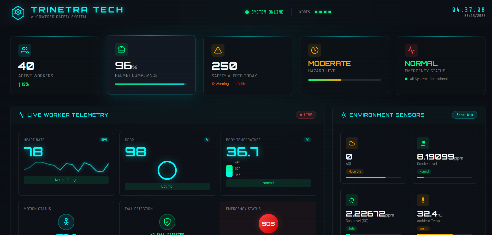
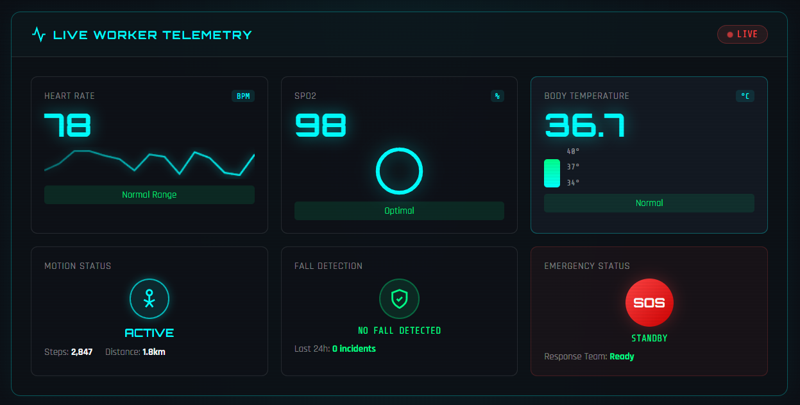
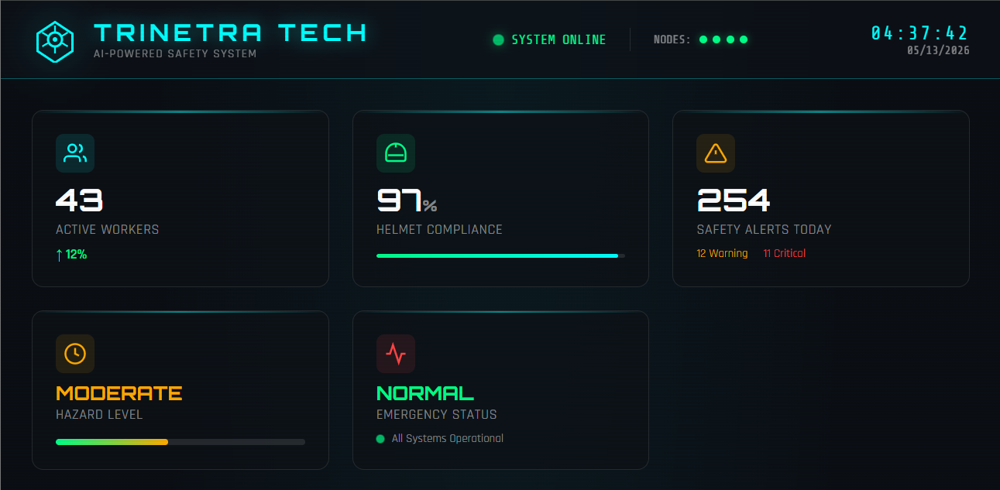
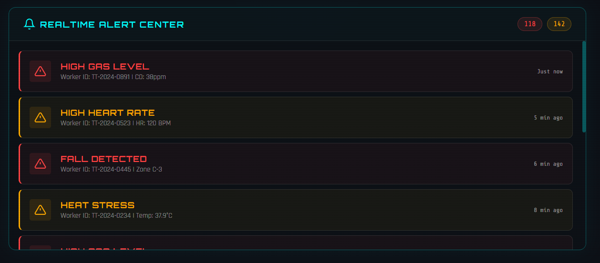
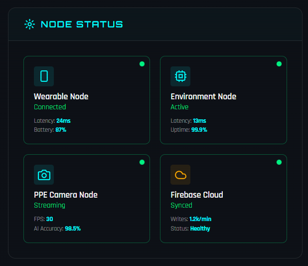
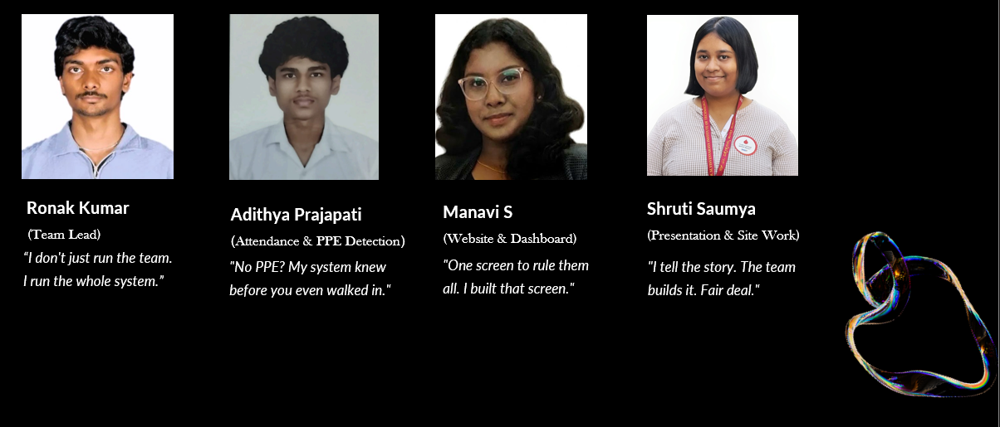

# TRINETRA TECH

### AI-Powered Occupational Health & Safety Platform for Industrial Workers

---

## Overview

TRINETRA TECH is a real-time AIoT safety platform designed for construction and industrial environments. The system combines wearable health monitoring, environmental hazard sensing, AI-powered PPE verification, cloud synchronization, and realtime emergency alerts into a unified industrial safety infrastructure.

The platform enables supervisors and safety officers to monitor workforce safety conditions in realtime while proactively identifying high-risk situations before accidents occur.

---

## Core Features

| Module               | Function                                           |
| -------------------- | -------------------------------------------------- |
| AI PPE Detection     | Verifies worker helmet compliance before entry     |
| RFID Attendance      | Smart worker identification & access control       |
| Wearable Health Node | Heart rate, SpO2, body temperature monitoring      |
| Fall Detection       | Detects worker falls and emergency conditions      |
| Environmental Node   | Gas, smoke, AQI, humidity & temperature monitoring |
| Firebase Cloud       | Realtime synchronization between all nodes         |
| Alert Engine         | Realtime emergency escalation and hazard alerts    |
| Dashboard            | Centralized industrial safety operations interface |


* AI-powered helmet & PPE verification
* RFID-based smart attendance system
* Realtime worker health telemetry
* Environmental hazard monitoring
* Fall detection and emergency alerts
* Firebase cloud synchronization
* Industrial safety dashboard
* Google Sheets attendance logging
* Multi-node ESP32 architecture
* Realtime alert center

---

## System Architecture

### Edge Devices

* ESP32 Wearable Health Node
* ESP32 Environmental Monitoring Node
* ESP32-CAM PPE Detection Node
* RFID Attendance Module

### Cloud Infrastructure

* Firebase Realtime Database
* Flask AI Inference Server
* Google Sheets Logging API

### Frontend

* Industrial Safety Operations Dashboard
* Realtime Telemetry Visualization
* Hazard Monitoring Interface
* Incident Alert Center

---

## Dashboard Preview

### Full Industrial Safety Command Center



### Live Worker Telemetry



### Environmental Monitoring & RFID Access



### Realtime Emergency Alert Center



### Distributed Node Infrastructure



---

## AI Pipeline

Worker Image
→ ESP32-CAM Capture
→ Flask AI Server
→ OpenCLIP Inference
→ PPE Verification
→ Firebase Sync
→ Dashboard Update
→ Emergency Alert Engine

---
## Live System Workflow

1. Worker scans RFID card at entry checkpoint
2. ESP32-CAM captures worker image
3. Flask AI server performs PPE verification
4. Access decision generated in realtime
5. Attendance logged into Google Sheets
6. Wearable telemetry continuously streams health data
7. Environmental node monitors hazardous conditions
8. Firebase synchronizes all telemetry data
9. Dashboard visualizes live site conditions
10. Alert engine escalates emergencies instantly

---
## Technology Stack

### Hardware

* ESP32
* ESP32-CAM
* RFID Module
* MAX30102
* MPU6050
* MQ Gas Sensors
* DHT11

### Backend

* Python
* Flask
* OpenCLIP
* Firebase

### Frontend

* HTML
* CSS
* JavaScript

### Cloud

* Firebase Realtime Database
* Google Sheets API

---

## Repository Structure

```bash
ai-server/
dashboard/
firmware/
media/
presentations/
```

---

## Future Roadmap

* Edge AI inference
* Predictive safety analytics
* Worker digital twin
* Mobile application
* Autonomous site rover
* AI incident prediction
* Smart helmet integration

---

## Team TRINETRA TECH

* Ronak Kumar — Team Lead
* Adithya Prajapati — Attendance & PPE Detection
* Manavi S — Website & Dashboard
* Shruti Saumya — Presentation & Site Work

---

## Vision

Our goal is to build intelligent occupational safety infrastructure capable of preventing workplace accidents before they occur through realtime AI-powered monitoring and predictive safety analytics.

---
## Why TRINETRA TECH Matters

Construction and industrial environments continue to rely heavily on reactive safety systems and manual supervision. TRINETRA TECH transforms occupational safety into a proactive, AI-driven infrastructure capable of identifying risk conditions before incidents escalate into emergencies.

Our goal is to build intelligent industrial safety systems that combine realtime AI monitoring, wearable telemetry, environmental sensing, and predictive analytics to reduce workplace accidents and improve emergency response efficiency.
